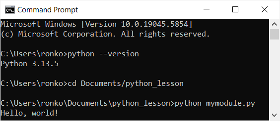
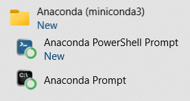
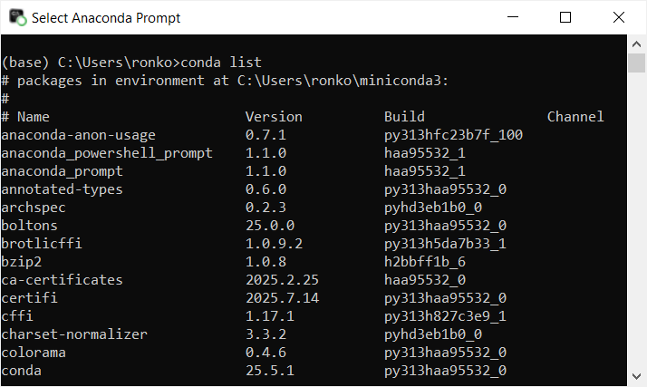
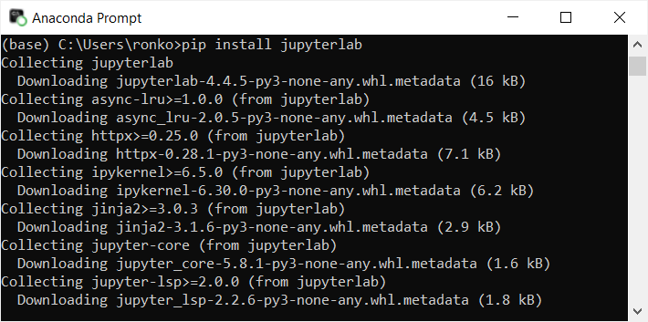

# Python for Data Science

This is a set of lessons in Python programming for people who have never written code in any programming language before.
We do not assume any prior knowledge of programming terminology and concepts.
The only prerequisite is to have some basic math knowledge (e.g. prime numbers, sets, functions).

The lessons cover all programming terminology, concepts and Python best practices.
We provide code examples, explanations and coding exercises with solutions.
You need to study code patterns and understand every line of code in the examples.
After that, type (or modify, if you like) and run the code to build your muscle memory.  

We encourage you to learn programming like you would learn a foreign language - incrementally through regular speaking, reading and writing.
It takes years to fluently speak and write in a foreign language. While programming is arguably easier, it will take many months of regular practice to master your first programming language.
If you are a full-time student or have a day job, it is more effective to commit to 30 minutes of daily practice over one year than to try to learn everything in one month.

  

### HOW DO I RUN PYTHON CODE?

To run Python code, you need to install the Python Interpreter (we will refer to it as Python when it is clear that we are referring to the software, not the language) which checks and runs Python code. While it is possible to type your code in a text editor (e.g. Notepad in Windows) and run your code using a command line application (e.g. Windows PowerShell), it is much easier to type and run your code in an [Integrated Development Environment (IDE)](https://en.wikipedia.org/wiki/Integrated_development_environment). IDEs are software that help programmers to manage software projects and write code efficiently.     

There are different ways to install Python and there are many IDEs that support Python. We will show you two installation options for Windows.

### OPTION 1: INSTALLING PYTHON FROM THE OFFICIAL WEBSITE
You can download and install Python from the official Python website [https://www.python.org](https://www.python.org). On the Windows Installer, select `Add python.exe to PATH` so that you can run your code from any path on a command line.

<kbd>

</kbd>
<br><br>

This installs the following applications:

<kbd>

</kbd>
<br><br>


<!---->
<!-- DOES NOT WORK-->

This installation includes a basic interactive IDE called IDLE (Integrated Development and Learning Environment):

<kbd>

</kbd>
<br><br>

To run Python modules (code files saved with the `.py` extension) on a command line, type and save your code in a text editor (e.g `mymodule.py`) and run your code in Windows PowerShell or Command Prompt by entering the command `python mymodule.py`: 

<kbd>

</kbd>
<br><br>

Although installing Python is easy this way and IDLE is easy to use, we do not recommend this option for beginners. 

### OPTION 2: INSTALLING MINICONDA AND JUPYTERLAB
For a much better IDE and learning experience, we recommend using [JupyterLab](https://pypi.org/project/jupyterlab/), an IDE that runs in a web browser. We also recommend installing
[conda](https://docs.conda.io/en/latest/) for managing virtual environments and [pip](https://pypi.org/project/pip/) for installing other Python packages.

<!-- (https://docs.conda.io/en/latest/) -->

The two-step installation process will be as follows:
- Download and install [Miniconda](https://www.anaconda.com/docs/getting-started/miniconda/main#should-i-install-miniconda-or-anaconda-distribution). Miniconda is one of two Python distributions (a curated collection of Python packages) from [Anaconda](https://www.anaconda.com/). By installing Miniconda, you will install the latest version of Python, conda, pip and a number of other packages.
- Install JupyterLab using pip.

At this point, you may be wondering: What is a [virtual environment](https://docs.python.org/3/library/venv.html)? What is a [Python package](https://docs.python.org/3/tutorial/modules.html#packages)? Let's first proceed with our installation. We will explain these terms along the way.

When installation of Miniconda is complete, you will see the following applications (screenshot from Windows 10):

<kbd>

</kbd>
<br><br>

Open Anaconda Prompt, a command line application. It shows the name of the default virtual environment, which is `base`. Enter `conda list` at the prompt:

<kbd>

</kbd>
<br><br>

The `conda list` command lists all the Python packages installed within the `base` virtual environment.   

A Python package is a collection of Python code. Python packages extend Python's functionality. For example, the [scikit-learn](https://pypi.org/project/scikit-learn/) package is used for creating machine learning models. All packages can be found in the Python Package Index [https://pypi.org](https://pypi.org/), the official repository for Python packages.  

A virtual environment is an isolated workspace for a software project. In other words, a directory is created for the project, and all project files, including files for installed packages, will reside within this directory.   

For most of our lessons, we will be writing programs using the `base` virtual environment. We will learn to create a new virtual environment when we learn to use packages like [pandas](https://pypi.org/project/pandas/) not found in the `base` virtual environment.

Within the `base` virtual environment, the installed version of Python (3.13.5) and the complete list of installed packages is shown below. Other than conda and pip, installed packages include packages that Python, conda and pip depend on and a small number of other useful packages.

```
Name                          Version          Build               Channel
anaconda-anon-usage           0.7.1            py313hfc23b7f_100 
anaconda_powershell_prompt    1.1.0            haa95532_1  
anaconda_prompt               1.1.0            haa95532_1
annotated-types               0.6.0            py313haa95532_0
archspec                      0.2.3            pyhd3eb1b0_0
boltons                       25.0.0           py313haa95532_0
brotlicffi                    1.0.9.2          py313h5da7b33_1
bzip2                         1.0.8            h2bbff1b_6
ca-certificates               2025.2.25        haa95532_0
certifi                       2025.7.14        py313haa95532_0
cffi                          1.17.1           py313h827c3e9_1
charset-normalizer            3.3.2            pyhd3eb1b0_0
colorama                      0.4.6            py313haa95532_0
conda                         25.5.1           py313haa95532_0
conda-anaconda-telemetry      0.2.0            py313haa95532_1
conda-anaconda-tos            0.2.1            py313haa95532_0
conda-content-trust           0.2.0            py313haa95532_1
conda-libmamba-solver         25.4.0           pyhd3eb1b0_0
conda-package-handling        2.4.0            py313haa95532_0
conda-package-streaming       0.12.0           py313haa95532_0
cpp-expected                  1.1.0            h214f63a_0
cryptography                  45.0.3           py313h51e0144_0
distro                        1.9.0            py313haa95532_0
expat                         2.7.1            h8ddb27b_0
fmt                           9.1.0            h6d14046_1
frozendict                    2.4.2            py313haa95532_0
idna                          3.7              py313haa95532_0
jsonpatch                     1.33             py313haa95532_1
jsonpointer                   2.1              pyhd3eb1b0_0
libarchive                    3.7.7            h9243413_0
libcurl                       8.14.1           ha9f67de_0
libffi                        3.4.4            hd77b12b_1
libiconv                      1.16             h2bbff1b_3
libmamba                      2.0.5            hcd6fe79_1
libmambapy                    2.0.5            py313h214f63a_1
libmpdec                      4.0.0            h827c3e9_0
libsolv                       0.7.30           hf2fb9eb_1
libssh2                       1.11.1           h2addb87_0
libxml2                       2.13.8           h866ff63_0
lz4-c                         1.9.4            h2bbff1b_1
markdown-it-py                2.2.0            py313haa95532_1
mdurl                         0.1.0            py313haa95532_0
menuinst                      2.3.0            py313h5da7b33_0
nlohmann_json                 3.11.2           h6c2663c_0
openssl                       3.0.16           h3f729d1_0
packaging                     24.2             py313haa95532_0
pcre2                         10.42            h0ff8eda_1
pip                           25.1             pyhc872135_2
platformdirs                  4.3.7            py313haa95532_0
pluggy                        1.5.0            py313haa95532_0
pybind11-abi                  5                hd3eb1b0_0
pycosat                       0.6.6            py313h827c3e9_2
pycparser                     2.21             pyhd3eb1b0_0
pydantic                      2.11.7           py313haa95532_0
pydantic-core                 2.33.2           py313h215eeae_0
pygments                      2.19.1           py313haa95532_0
pysocks                       1.7.1            py313haa95532_0
python                        3.13.5           h286a616_100_cp313
python_abi                    3.13             0_cp313
reproc                        14.2.4           hd77b12b_2
reproc-cpp                    14.2.4           hd77b12b_2
requests                      2.32.4           py313haa95532_0
rich                          13.9.4           py313haa95532_0
ruamel.yaml                   0.18.10          py313h827c3e9_0
ruamel.yaml.clib              0.2.12           py313h827c3e9_0
setuptools                    78.1.1           py313haa95532_0
simdjson                      3.10.1           h214f63a_0
spdlog                        1.11.0           h59b6b97_0
sqlite                        3.50.2           hda9a48d_1
tk                            8.6.14           h5e9d12e_1
tqdm                          4.67.1           py313h4442805_0
truststore                    0.10.0           py313haa95532_0
typing-extensions             4.12.2           py313haa95532_0
typing-inspection             0.4.0            py313haa95532_0
typing_extensions             4.12.2           py313haa95532_0
tzdata                        2025b            h04d1e81_0
ucrt                          10.0.22621.0     haa95532_0
urllib3                       2.5.0            py313haa95532_0
vc                            14.3             h2df5915_10
vc14_runtime                  14.44.35208      h4927774_10
vs2015_runtime                14.44.35208      ha6b5a95_10
wheel                         0.45.1           py313haa95532_0
win_inet_pton                 1.1.0            py313haa95532_0
xz                            5.6.4            h4754444_1
yaml-cpp                      0.8.0            hd77b12b_1
zlib                          1.2.13           h8cc25b3_1
zstandard                     0.23.0           py313h4fc1ca9_1
zstd                          1.5.6            h8880b57_0
```

<!--
<kbd>

</kbd>
<br><br>
-->

Missing from this list is JupyterLab. Enter `pip install jupyterlab` in Anaconda Prompt.
This command downloads and installs JupyterLab and other packages it depends on from the Python Package Index. Another way to install JupyterLab is to use the command `conda install -c conda-forge jupyterlab`, which downloads and installs JupyterLab from the [Conda Forge](https://conda-forge.org/) repository.

To open JupyterLab, enter `jupyter-lab` (note the hyphen) in Anaconda Prompt. This will open JupyterLab in your default web browser.

<kbd>

</kbd>
<br><br>

To type and run your code interactively, use Notebooks. Select `File` -> `New` -> `Notebook` to open a new Notebook, then select the default kernel option Python 3 (ipykernel):

<kbd>

</kbd>
<br><br>

In any cell, enter your code and click on the Run button (or use the keyboard shortcut `Shift` `Enter`):

<kbd>

</kbd>
<br><br>

Please refer to the JupyterLab [documentation](https://jupyterlab.readthedocs.io/en/latest/) for a complete user guide. You are now ready for our lessons.
