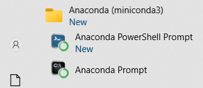

# Python for Data Science

## INTRODUCTION

Welcome!

This course in Python programming is for people who have never written code in any programming language before.
It does not assume you know any programming terminology and concepts (not specific to Python).  
The only prerequisite is to have some basic math knowledge (e.g. prime numbers, sets, functions).
 
Learn programming like you would learn a foreign language - incrementally over months and years through regular reading and writing and short practices everyday.
Just as you do not master a foreign language in a few months, it will take you much longer to master your first programming language.
If you are a full-time student or have a day job, it is more effective to commit to 30 minutes of focused practice a day than to try to learn everything in one month.

The lessons cover all programming terminology, concepts and Python best practices.
We present code examples and provide coding exercises with solutions. You need to study code patterns and understand every line of code in the examples.
After that, type (or modify, if you like) and run the code to build your muscle memory.    

### WHERE DO I RUN PYTHON CODE?

You type and run code in an [Integrated Development Environment (IDE)](https://en.wikipedia.org/wiki/Integrated_development_environment). IDEs are software that help developers to manage software projects and write code efficiently.     

Given the many choices of IDEs for Python, installing and setting up your programming environment for the first time is a tricky process. There are also different ways to install Python (or, to be precise, the Python Interpreter, which is the software that checks and executes Python code). One option (which we do not recommend) is to install Python from the official [Python website](https://www.python.org/). This installation includes a basic interactive IDE called IDLE (Integrated Development and Learning Environment):

<!---->
<!-- DOES NOT WORK-->
<kbd>

</kbd>
  

### INSTALLING MINICONDA AND JUPYTERLAB

For a much better IDE and learning experience, we recommend using the [JupyterLab](https://jupyter.org) IDE. For ease of installing JupyterLab and other [Python packages](https://pypi.org/) for your future projects, download and install [Miniconda](https://www.anaconda.com/docs/getting-started/miniconda/main#should-i-install-miniconda-or-anaconda-distribution). Miniconda is one of two Python distributions (a collection of Python packages) from [Anaconda](https://www.anaconda.com/). By installing Miniconda, you will install the latest version of Python (version 3.13.5 at the time of writing this guide) and [Conda](https://docs.conda.io/en/latest/), the environment and package manager application. You will also install other packages that Python and Conda depend on (i.e. packages required for Python and Conda to work) and a small number of other useful packages, according to the [Anaconda guide](https://www.anaconda.com/docs/getting-started/miniconda/main).

Once installed, you will see the following two applications (screenshot from Windows 10):

<kbd>

</kbd>
  

Open Anaconda Prompt, which is a command line application for managing your installations. It shows the name of the default environment, which is `base`. Enter `conda list` at the prompt:

<kbd>

</kbd>
  

This `conda list` command lists all the Python packages installed in the `base` environment. Missing from this list is JupyterLab, which we need to install. Enter `pip install jupyterlab` at the prompt:

<kbd>

</kbd>
  

This command downloads and installs JupyterLab (and other packages it depends on) from the [Python Package Index](https://pypi.org/project/jupyterlab/), a repository of all Python packages created by developers all over the world. Other options for installing JupyterLab is provided in [Python Package Index](https://pypi.org/project/jupyterlab/), including the command `conda install -c conda-forge jupyterlab`, which downloads and installs JupyterLab from the [Conda Forge](https://conda-forge.org/) repository.

To type and run your code interactively, use Notebooks. Select `File` > `Notebook` to open a new Notebook, then select the default option (Python 3):

<kbd>

</kbd>
  

In the first cell, enter your code and click on the Run button (or use the keyboard shortcut `Shift` `Enter`):

<kbd>

</kbd>
  

You are now ready for your first lesson.

<!--At this point, you may also start to wonder what exactly are packages and environments, and why there are so many packages installed by default.  -->

