# Python for Data Pactitioners

This is a course in Python programming for people who have never written code in any multi-purpose programming language before. 
Although the course is designed for aspiring data practitioners, it is suitable for anyone interested in learning Python.
We do not assume any prior knowledge of programming terminology and concepts.
The only prerequisite is to have some basic math knowledge (e.g. prime numbers, sets, functions). 

The lessons cover all programming terminology, concepts and Python best practices.
We provide code examples, explanations and coding exercises with solutions.
You need to study code patterns and understand every line of code in the examples.
After that, type (or modify, if you like) and run the code to build your muscle memory. 
It is also often necessary to use the command line interface (e.g. Windows PowerShell, Command Prompt). 
All commands will be explained for the benefit of those with little experience.

We encourage you to learn programming like you would learn a foreign language - incrementally through regular speaking, reading and writing.
It takes years to fluently speak and write in a foreign language. While programming is arguably easier, it will take many months of regular practice to master your first programming language.
If you are a full-time student or have a day job, it is more effective to commit to 30 minutes of daily practice over one year than to try to learn everything in one month.

<!--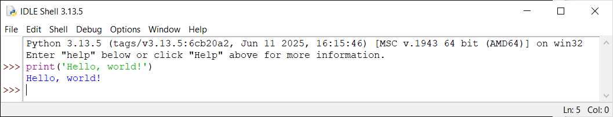-->
<!-- DOES NOT WORK-->

### HOW DO I RUN PYTHON CODE?

To run Python code, you need to install the Python Interpreter (we will refer to it as Python when it is clear that we are referring to the software, not the language) which checks and runs Python code. 

There are two ways to run Python code:
- Type and save your code as a Python module (a file saved with the `.py` extension) in a text editor (e.g. Notepad). Run the module on a command line interface.
- Type and run your code in an [Integrated Development Environment (IDE)](https://en.wikipedia.org/wiki/Integrated_development_environment). IDEs are software that help programmers to manage software projects and write code efficiently.

There are many IDEs that support Python. For beginners, we recommend using [JupyterLab](https://pypi.org/project/jupyterlab/) which runs in a web browser. The following section shows you the installation of Python and JupyterLab in Windows.  

<!--There are different ways to install Python. We will show you two installation options for Windows.-->

### INSTALLING PYTHON AND JUPYTERLAB

In this tutorial, we will:
- Download and run the Windows Installer from the official Python website at [https://www.python.org](https://www.python.org). This installation will install the latest version of Python and a software called pip, used for installing and uninstalling Python packages. It will also install an interactive IDE and the complete documentation. 
- Type and run Python code in the IDE installed.
- Type and run Python code in Command Prompt. 
- Run a Python module in Command Prompt.
- Install JupyterLab using pip in Command Prompt.

First, run the Windows Installer. Remember to select `Add python.exe to PATH` on the Windows Installer so that you can run your code from any path on a command line. 

<kbd>
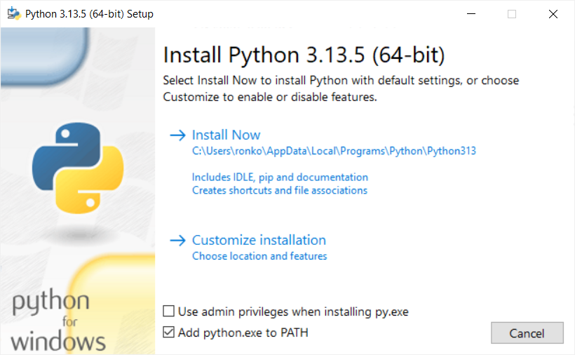
</kbd>
  

This installation includes a simple IDE called IDLE (Integrated Development and Learning Environment) and a command line interface that works like IDLE. The installation also provides the complete documentation:

<kbd>
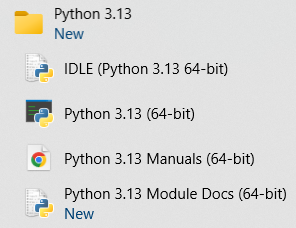
</kbd>
  

<kbd>

</kbd>
  

<kbd>
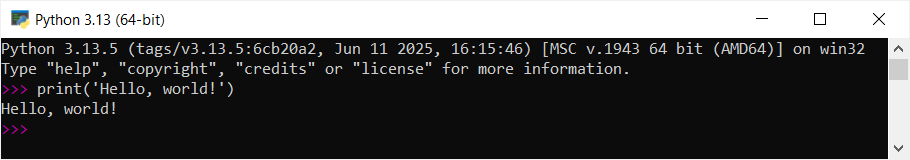
</kbd>
  

Test that you can access Python and pip in Command Prompt by checking the versions of Python and pip. Enter `python --version` and `pip --version`. Enter `pip list` to see the list of packages installed and their versions. pip is now the only package installed. 

<kbd>
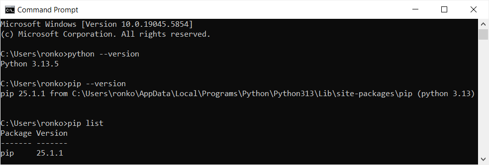
</kbd>
  

You can also type and run your code in Command Prompt. Enter `python` to access Python. Enter `exit` or `quit` to exit: 

<kbd>
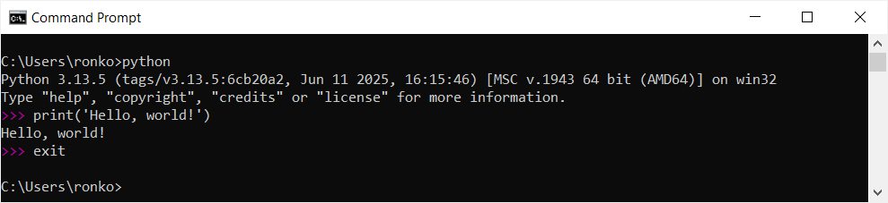
</kbd>
  

Next, type `print('Hello, world!')` in Notepad and save your code as a Python module (e.g `mymodule.py`). 
Enter `cd` followed by the path to the directory where you saved your module. Run your module by entering the command `python mymodule.py`: 

<kbd>
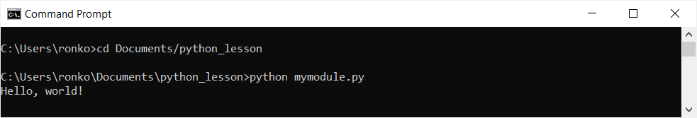
</kbd>
  

To install [JupyterLab](https://pypi.org/project/jupyterlab/), enter the command `pip install JupyterLab`. This command downloads and installs JupyterLab and other packages it depends on from the Python Package Index (PyPI) at [https://pypi.org](https://pypi.org/), the official software repository for publicly available Python packages. 
When installation is complete, you will see the names of all the packages installed. You can also see the list of installed packages by entering `pip list`.

<kbd>
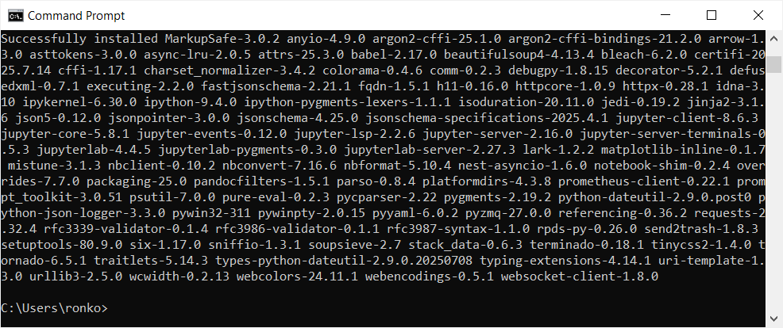
</kbd>
  

At this point, you may be wondering: What is a [Python package](https://docs.python.org/3/tutorial/modules.html#packages)? Why are there so many packages installed? What does pip actually do?

A Python package is a collection of Python code. Python packages extend Python's functionality. For example, the [scikit-learn](https://pypi.org/project/scikit-learn/) package is used for creating machine learning models. Most publicly available packages are found in PyPI because anyone can develop and publish a package to PyPI. You can now find a Python package for almost any functionality. This is one of the reasons why Python is so widely used. When you develop a new package, there will be functionalities that you may not need to implement yourself since there are publicly available packages for many functionalities that you can import into your code. These packages that you import become your package's dependencies.
It is therefore not unusual for a package to depend on many other packages.  

pip is a package installer and manager. It is used for installing and uninstalling other packages. pip downloads and installs packages from PyPI by default, but it can also install packages from other sources, such as your local directories. When installing a package, pip identifies and installs the correct versions of any other packages that the package depends on.

To launch JupyterLab, enter `jupyter-lab` (note the hyphen) in Command Prompt. This will open JupyterLab in your default web browser.

<kbd>
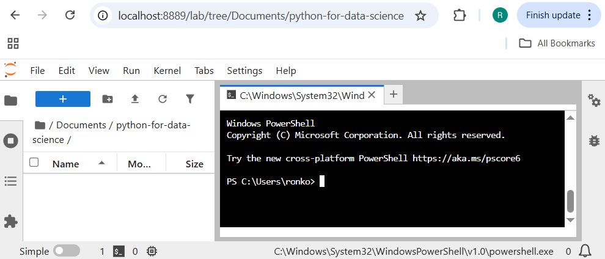
</kbd>
  

To type and run your code interactively, use Notebooks. Click on the Notebook icon, or select `File` -> `New` -> `Notebook` to open a new Notebook, then select the default kernel option Python 3 (ipykernel):

<kbd>
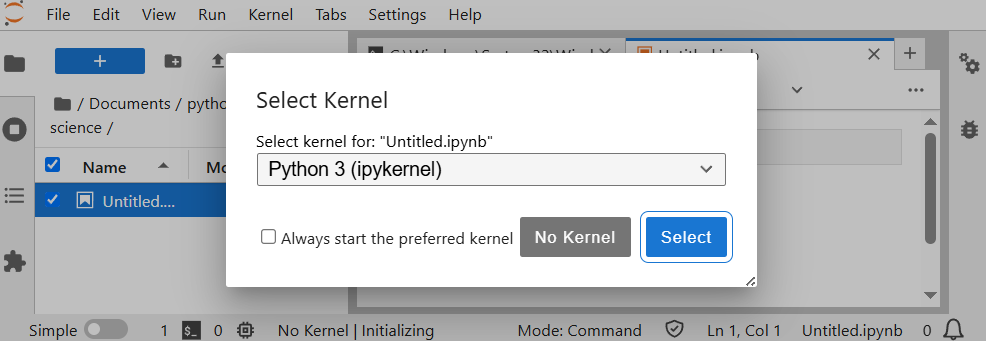
</kbd>
  

In any cell, enter your code and click on the Run button (or use the keyboard shortcut `Shift` `Enter`):

<kbd>
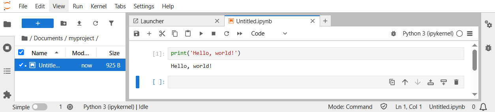
</kbd>
  

Please refer to the JupyterLab [documentation](https://jupyterlab.readthedocs.io/en/latest/) for a complete user guide. You are now ready for our lessons.
